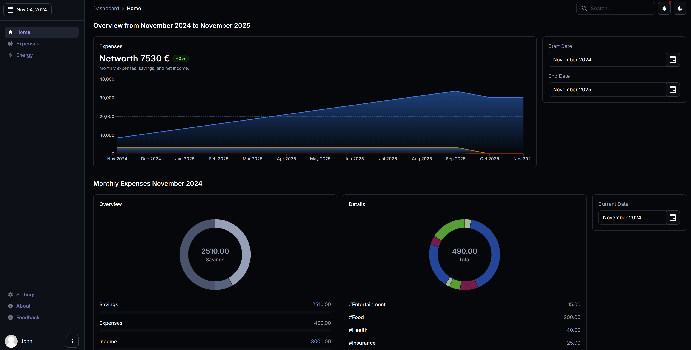

# Home Dashboard API


## Overview
The **Home Dashboard API** is a RESTful web service built with [FastAPI](https://fastapi.tiangolo.com/). This API offers session-based authentication using OAuth2 JWT tokens managed via HTTP cookies. It enables users to perform CRUD operations on user accounts, manage personal expenses, and gain insights into financial metrics such as income, savings, and expenses, both on a monthly basis and over longer time periods.

## Showcase
Below is an example of the type of financial insights you can obtain from this API:



## Features
- **User Management**
  - Create, update, and delete user accounts.
  - Secure user authentication using OAuth2 with JWT tokens.
- **Expense Management**
  - Add, modify, and delete personal expenses.
  - Categorize expenses for better insights.
- **Financial Insights**
  - View reports on monthly and long-term income and savings.
  - Track trends in expenses over different time periods.

## Prerequisites
Before running the application, ensure you have the following installed:
- Python 3.8+
- [FastAPI](https://fastapi.tiangolo.com/)
- [Uvicorn](https://www.uvicorn.org/) for running the server.
- [SQLAlchemy](https://www.sqlalchemy.org/) or another ORM for database integration.
- JWT library (e.g., `python-jose`).
- Cookie management library (`fastapi-jwt-auth` or `fastapi-users`).

## Installation
1. **Clone the repository**
   ```bash
   git clone git@github.com:Hussam-Turjman/home_dashboard_api.git
   cd home_dashboard_api
   ```

2. **Create and activate a virtual environment**
   ```bash
   python3 -m venv venv
   source venv/bin/activate  # On Windows use `venv\Scripts\activate`
   ```

3. **Install dependencies**
   ```bash
   pip install -r requirements.txt
   ```

## Configuration
Configure environment variables for database access and JWT secret keys:
```env
DB_USER=username
DB_USER_PASSWORD=password
DB_NAME=db_name
DB_HOSTNAME=localhost
ENDPOINT=localhost
ENDPOINT_PORT=5001
JWT_SECRET_KEY='secret'
```

## Running the API
Start the FastAPI server using Uvicorn:
```bash
python3 home_dashboard_api.py
```
- The API will be available at `http://127.0.0.1:5001`.

## API Endpoints
### Authentication
- **POST /api/user/authenticate**: Authenticate a user and issue a JWT token stored in an HTTP-only cookie.
- **POST /api/user/logout**: Invalidate the session by clearing the cookie.

### User Management
- **GET /api/user/{session_id}**: Retrieve details about the currently authenticated user.

### Expense Management
- **PUT /api/expenses/add_account_entry/{session_id}**: Add or Modify an existing expense entry.
- **DELETE /api/expenses/delete_account_entry/{session_id}/{entry_id}**: Delete a specific expense entry.
- **GET /api/expenses/account_entries/{session_id}**: Retrieve all expense entries for the current user.
-
### Financial Insights
- **GET /api/expenses/month_expenses/{session_id}**: Get a summary of income, expenses, and savings for the current or specified month.
- **GET /api/expenses/overview_chart/{session_id}**: View a long-term overview of financial metrics over a chosen time period.

## Authentication Flow
- The API uses session-based authentication with JWT tokens.
- Users log in via the `/api/user/authenticate` endpoint and receive a token stored as a secure HTTP-only cookie and a session id that should be handled by the frontend application.
- Subsequent requests use this cookie and the session_id for authorization.

## Security Best Practices
- **HTTP-Only Cookies**: Ensures tokens aren't accessible via JavaScript for added security.
- **JWT Tokens**: Configured with a short expiration time to minimize security risks.
- **Data Encryption**: Always use HTTPS in production for encrypted communication.

## Contributing
Feel free to contribute by opening issues or submitting pull requests.

1. Fork the repository.
2. Create a new branch: `git checkout -b feature/YourFeature`
3. Commit your changes: `git commit -m 'Add some feature'`
4. Push to the branch: `git push origin feature/YourFeature`
5. Submit a pull request.

## License
This project is licensed under the MIT License. See the [LICENSE](LICENSE) file for more details.

## Contact
For questions or feedback, please reach out to `hussam.turjman@gmail.com`.

---

Enjoy managing your finances with ease!
